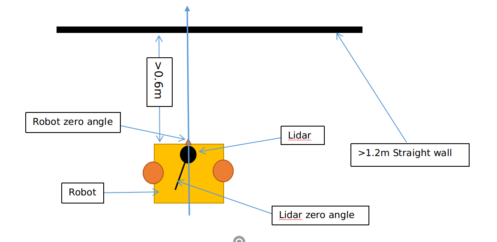

YDLIDAR SDK [](https://travis-ci.org/cansik/sdk) [](https://ci.appveyor.com/project/cansik/sdk) [](https://codebeat.co/projects/github-com-cansik-sdk-samsung)
=====================================================================


Introduction
-------------------------------------------------------------------------------------------------------------------------------------------------------

YDLIDAR(https://www.ydlidar.com/) series is a set of high-performance and low-cost LIDAR sensors, which is the perfect sensor of 2D SLAM, 3D reconstruction, multi-touch, and safety applications.

If you are using ROS (Robot Operating System), please use our open-source [ROS Driver]( https://github.com/ydlidar/ydlidar) .

Release Notes
-------------------------------------------------------------------------------------------------------------------------------------------------------
| Title      |  Version |  Data |
| :-------- | --------:|  :--: |
| SDK     |  2.1.1 |   2020-03-06  |

- [feat]  SDK exceptional case of false generation,  the specific holding time from “few” seconds to 30 seconds.
- [fixed] fixed local_scan size.
- [feat] the timeout is greater than the default value before the exception message is printed.

## Zero Angle calibration


The Robot is put into the calibration tool required in the above figure to ensure that the zero angle direction of the robot is perpendicular to the wall.
If the difference between the Lidar zero angle direction and the robot zero angle direction is greater than 90 degrees, the same as the figure above.
the `setRobotLidarOpposite` in SDK is set to true.
```
  CYdLidar laser;
  laser.setRobotLidarOpposite(true);
```
otherwise, the difference is less than 90 degrees, the `setRobotLidarOpposite` in SDK is set to false.
```
  CYdLidar laser;
  laser.setRobotLidarOpposite(false);
```
#### How to start zero angle correction
SDK turns off correction model by default. If you want to start by execution the `setStartRobotAngleOffset` command once, SDK will start the correction of zero angle.
```
  CYdLidar laser;
  laser.setStartRobotAngleOffset();
```
`isRobotAngleOffsetCorrected` command will return true if the correction is complete.
```
  CYdLidar laser;
  if(laser.isRobotAngleOffsetCorrected()) {
	printf("Calibraion successful...\n");
  }
```
The calibration value will be saved in the file set by `setCalibrationFileName` command, you must set this value, 
Example:
```
  std::string calibration_filename = "Your's path/LidarAngleCalibration.ini";
  CYdLidar laser;
  laser.setCalibrationFileName(calibration_filename);//Zero angle offset filename
```
Note: The file format is an ini file,Requires .ini as extension.

After the calibration is successful, the next time the SDK starts, it will read the calibration value in the file, add this offset value to the Lidar data, and the output lidar data is already calibrated.

Note:
* 1. Zero Angle direction of the robot needs to be vertical to the wall.
* 2. `setCalibrationFileName` command file path and file name need to be set correctly.
* 3. `setRobotLidarOpposite` command parameters need to be set correctly.
* 4. calibration values are stored on the robot's internal memory area.
* 4. After the calibration is completed, the calibration model will be automatically closed, if you neeed to calibrate again, you can start the recalibration by `setStartRobotAngleOffset` command.


### Result as follows:


## Support

You can get support from YDLidar with the following methods:
* Send email to support@ydlidar.com with a clear description of your problem and your setup
* Github Issues

## Contact EAI


If you have any extra questions, please feel free to [contact us](http://www.ydlidar.cn/cn/contact)
